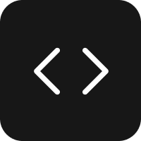

<div align="center">
  

# DevSnippets-AI

</div>

<p align="center">
  <a href="#"></a>
  <a href="#"></a>
  <a href="#"></a>
  <a href="#"></a>
  <a href="#"></a>
  <a href="#"></a>
  <a href="#"></a>
  <a href="#"></a>
</p>

A cross-platform mobile application built for developers to efficiently store, organize, and understand code snippets on the go. DevSnippets-AI combines local file storage with a fully integrated **AI assistant** capable of breaking down and explaining complex code in simple, beginner-friendly language.

---

🎥 **Demo:**  
[View Demo Video](https://drive.google.com/file/d/1SQj4ttGJaUx_wOZ5edTv8lqkj2Dwbxp3/view?usp=sharing)

A quick walkthrough of DevSnippets-AI application and its features.

## Features

- **AI Code Explanations (DevAi)** - Integrated chatbot UI powered by OpenRouter (GPT-4o-mini) to analyze and explain any of your saved code snippets.
- **Local Relational DB** - Fast & offline-first data storage powered by SQLite and Drizzle ORM.
- **Native File Storage** - Raw code is securely saved directly into the device's local document directory utilizing Expo File System.
- **Dynamic Syntax Highlighting** - Full syntax support for dozens of programming languages (`JavaScript`, `Python`, `Rust`, `Go`, etc.).
- **Rich Organization** - Categorize your library using custom Folders, Personality Tags, and Favorites.
- **JSON Backup & Restore** - Export your entire snippet library and schema offline and import it freely across devices.
- **Modern UI/UX** - Fully custom dark/light/system theme toggles built with TailwindCSS, NativeWind v4, and RN Primitives.
- **Cross-Platform** - Built targeting iOS, Android, and Web using a single shared codebase running on Expo SDK 56.

---

## Installation

### Prerequisites

- Node.js & Bun (or npm/yarn/pnpm)
- Expo CLI

### Setup

1. **Clone the repository:**

   ```bash
   git clone https://github.com/your-username/DevSnippets-AI.git
   cd DevSnippets-AI
   ```

2. **Install dependencies:**

   ```bash
   bun install
   ```

3. **Set up Environment Variables:**
   Create a `.env` file in the root directory and add your OpenRouter API Key:

   ```env
   EXPO_PUBLIC_OPENROUTER_API_KEY="your_api_key_here"
   ```

4. **Run Database Migrations:**

   ```bash
   bun run db:generate
   ```

5. **Start the App:**
   ```bash
   bun start
   ```

---

## Tech Stack Overview

- **Frontend:** Expo, React Native, Expo Router
- **State Management:** Zustand, AsyncStorage
- **Database:** SQLite (`expo-sqlite`), Drizzle ORM
- **AI Integration:** OpenRouter API (GPT-4o-mini)
- **Styling:** NativeWind 4.2, Lucide Icons
- **Form Handling:** React Hook Form, Zod

---

## License

This project is licensed under the [MIT License](LICENSE).
